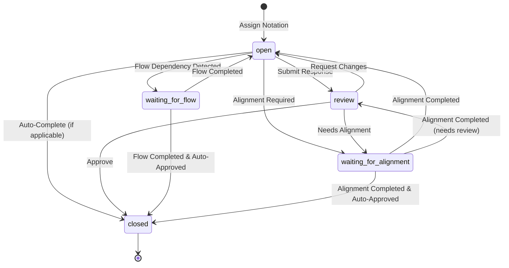
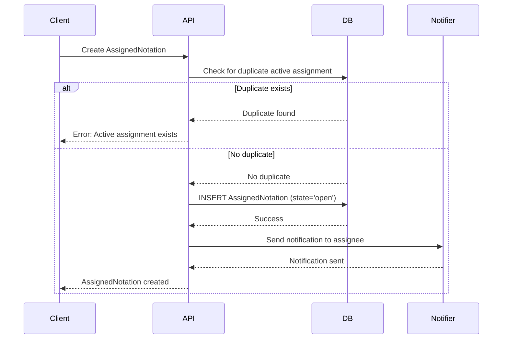
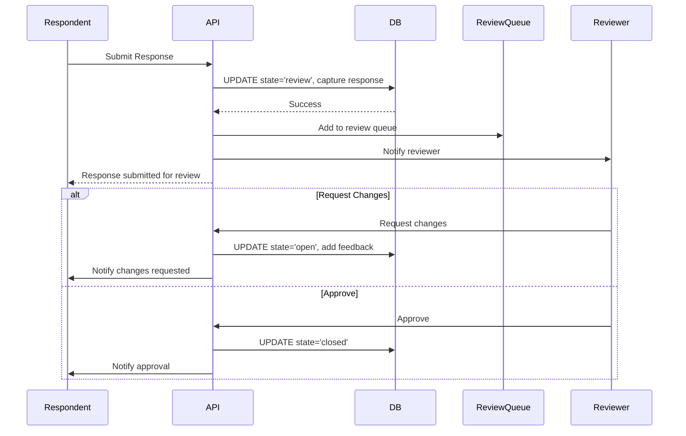
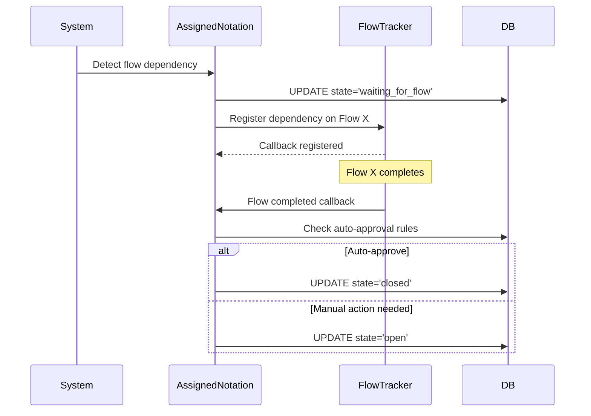
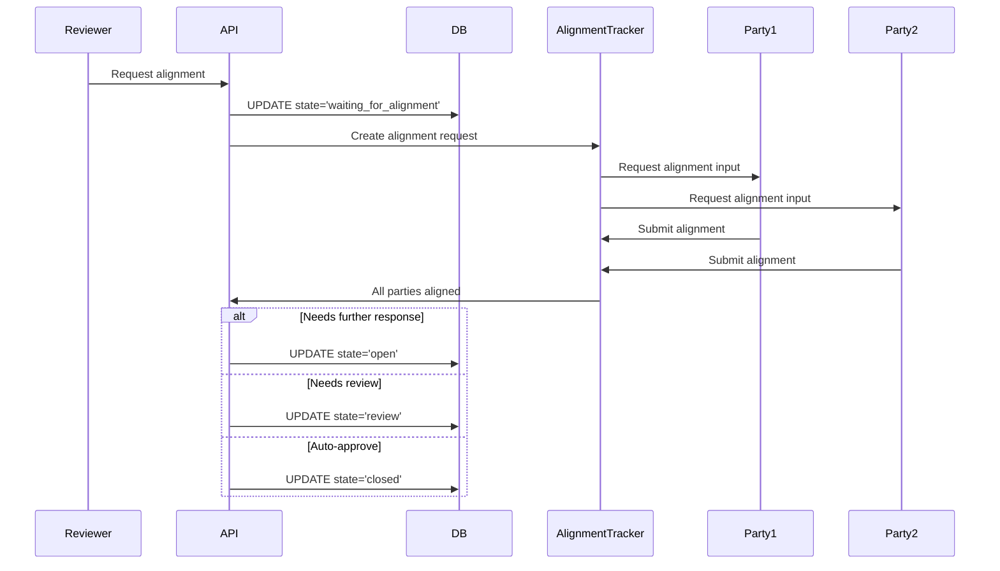
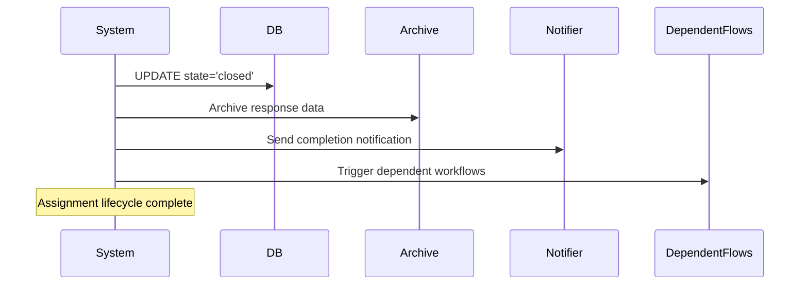
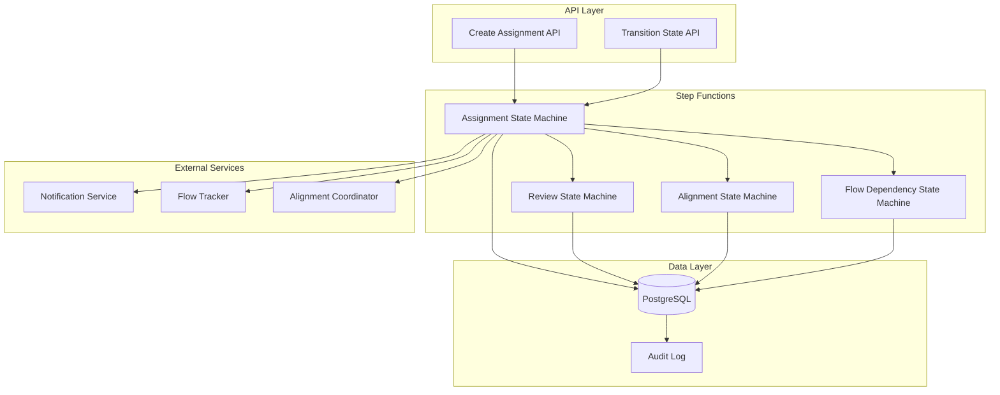
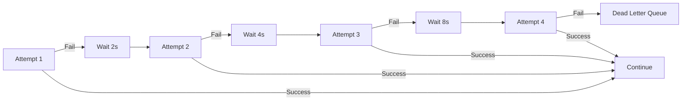
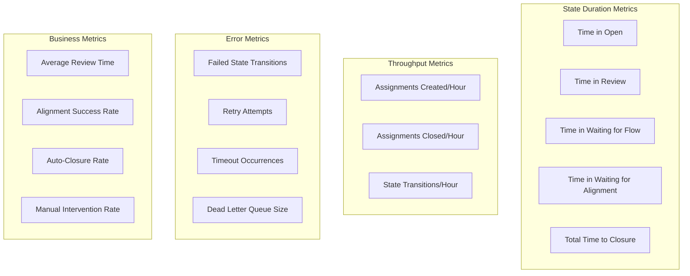

# AssignedNotation State Machine Design

## Overview

This document describes the state machine design for `AssignedNotation` entities, including state transitions, AWS Step Functions integration, retry logic, and database locking strategies to ensure reliable workflow execution.

## Current vs. Proposed State Model

### Current States
- `open` - Notation is assigned but not completed
- `closed` - Notation is completed

### Proposed Extended States
- `open` - Initial state when notation is first assigned
- `review` - Notation response is being reviewed
- `waiting_for_flow` - Notation is blocked waiting for a dependent flow to complete
- `waiting_for_alignment` - Notation is waiting for alignment with related entities/people
- `closed` - Notation is completed and finalized

## State Machine Diagram



## State Transition Details

### 1. Open State

**Purpose**: Initial assignment state where the respondent needs to complete the notation.

**Entry Actions**:
- Validate no duplicate active assignments exist (database check)
- Create database record with `state = 'open'`
- Send notification to assignee(s)
- Record assignment in audit log

**Possible Transitions**:
- → `review`: When respondent submits their response
- → `waiting_for_flow`: When a dependency on another flow is detected
- → `waiting_for_alignment`: When alignment with related entities/people is required
- → `closed`: When auto-completion rules are met (e.g., simple acknowledgment)



### 2. Review State

**Purpose**: The response has been submitted and is awaiting review by an authorized reviewer.

**Entry Actions**:
- Update state to `review`
- Capture submitted response data
- Assign to reviewer queue
- Send notification to reviewers
- Record state change in audit log

**Possible Transitions**:
- → `open`: When reviewer requests changes from the respondent
- → `waiting_for_alignment`: When reviewer identifies alignment needs
- → `closed`: When reviewer approves the response



### 3. Waiting for Flow State

**Purpose**: The notation is blocked because it depends on another flow or process to complete first.

**Entry Actions**:
- Update state to `waiting_for_flow`
- Record the blocking flow identifier(s)
- Register callback/webhook for flow completion
- Send notification explaining the wait
- Record dependency in audit log

**Possible Transitions**:
- → `open`: When the blocking flow completes and further action is needed
- → `closed`: When the blocking flow completes and auto-approval rules are met



### 4. Waiting for Alignment State

**Purpose**: The notation requires alignment or coordination with other people or entities before it can proceed.

**Entry Actions**:
- Update state to `waiting_for_alignment`
- Record alignment requirements (who/what needs to align)
- Send alignment requests to relevant parties
- Set alignment deadline (if applicable)
- Record alignment requirement in audit log

**Possible Transitions**:
- → `open`: When alignment is completed and respondent needs to update their response
- → `review`: When alignment is completed and response needs review
- → `closed`: When alignment is completed and auto-approval rules are met



### 5. Closed State

**Purpose**: The notation assignment is complete and finalized.

**Entry Actions**:
- Update state to `closed`
- Record completion timestamp
- Archive response data
- Send completion notification
- Record closure in audit log
- Trigger any dependent workflows

**Exit**: Terminal state (no further transitions)



## AWS Step Functions Integration

### High-Level Architecture



### Main State Machine Definition

```json
{
  "Comment": "AssignedNotation State Machine",
  "StartAt": "ValidateAssignment",
  "States": {
    "ValidateAssignment": {
      "Type": "Task",
      "Resource": "arn:aws:lambda:REGION:ACCOUNT:function:ValidateAssignment",
      "Retry": [
        {
          "ErrorEquals": ["States.TaskFailed"],
          "IntervalSeconds": 2,
          "MaxAttempts": 3,
          "BackoffRate": 2.0
        }
      ],
      "Catch": [
        {
          "ErrorEquals": ["DuplicateAssignmentError"],
          "ResultPath": "$.error",
          "Next": "HandleDuplicateError"
        }
      ],
      "Next": "CheckExistingAssignment"
    },
    "CheckExistingAssignment": {
      "Type": "Task",
      "Resource": "arn:aws:lambda:REGION:ACCOUNT:function:CheckActiveAssignment",
      "ResultPath": "$.existingAssignment",
      "Retry": [
        {
          "ErrorEquals": ["States.TaskFailed"],
          "IntervalSeconds": 1,
          "MaxAttempts": 3,
          "BackoffRate": 2.0
        }
      ],
      "Next": "HasExistingAssignment"
    },
    "HasExistingAssignment": {
      "Type": "Choice",
      "Choices": [
        {
          "Variable": "$.existingAssignment.exists",
          "BooleanEquals": true,
          "Next": "HandleDuplicateError"
        }
      ],
      "Default": "CreateAssignment"
    },
    "CreateAssignment": {
      "Type": "Task",
      "Resource": "arn:aws:lambda:REGION:ACCOUNT:function:CreateAssignment",
      "ResultPath": "$.assignment",
      "Retry": [
        {
          "ErrorEquals": ["States.TaskFailed"],
          "IntervalSeconds": 2,
          "MaxAttempts": 3,
          "BackoffRate": 2.0
        }
      ],
      "Next": "SendNotification"
    },
    "SendNotification": {
      "Type": "Task",
      "Resource": "arn:aws:lambda:REGION:ACCOUNT:function:SendNotification",
      "Retry": [
        {
          "ErrorEquals": ["States.TaskFailed"],
          "IntervalSeconds": 5,
          "MaxAttempts": 5,
          "BackoffRate": 2.0
        }
      ],
      "Catch": [
        {
          "ErrorEquals": ["States.ALL"],
          "ResultPath": "$.notificationError",
          "Next": "LogNotificationFailure"
        }
      ],
      "Next": "WaitForAction"
    },
    "WaitForAction": {
      "Type": "Task",
      "Resource": "arn:aws:states:::lambda:invoke.waitForTaskToken",
      "Parameters": {
        "FunctionName": "arn:aws:lambda:REGION:ACCOUNT:function:ProcessAction",
        "Payload": {
          "assignmentId.$": "$.assignment.id",
          "taskToken.$": "$$.Task.Token"
        }
      },
      "ResultPath": "$.action",
      "Next": "RouteAction"
    },
    "RouteAction": {
      "Type": "Choice",
      "Choices": [
        {
          "Variable": "$.action.type",
          "StringEquals": "SUBMIT_RESPONSE",
          "Next": "TransitionToReview"
        },
        {
          "Variable": "$.action.type",
          "StringEquals": "REQUEST_ALIGNMENT",
          "Next": "TransitionToWaitingForAlignment"
        },
        {
          "Variable": "$.action.type",
          "StringEquals": "DETECT_FLOW_DEPENDENCY",
          "Next": "TransitionToWaitingForFlow"
        },
        {
          "Variable": "$.action.type",
          "StringEquals": "AUTO_COMPLETE",
          "Next": "TransitionToClosed"
        }
      ],
      "Default": "WaitForAction"
    },
    "TransitionToReview": {
      "Type": "Task",
      "Resource": "arn:aws:states:::states:startExecution.sync:2",
      "Parameters": {
        "StateMachineArn": "arn:aws:states:REGION:ACCOUNT:stateMachine:ReviewStateMachine",
        "Input": {
          "assignmentId.$": "$.assignment.id",
          "response.$": "$.action.response"
        }
      },
      "ResultPath": "$.reviewResult",
      "Next": "HandleReviewResult"
    },
    "TransitionToWaitingForAlignment": {
      "Type": "Task",
      "Resource": "arn:aws:states:::states:startExecution.sync:2",
      "Parameters": {
        "StateMachineArn": "arn:aws:states:REGION:ACCOUNT:stateMachine:AlignmentStateMachine",
        "Input": {
          "assignmentId.$": "$.assignment.id",
          "alignmentRequirements.$": "$.action.alignmentRequirements"
        }
      },
      "ResultPath": "$.alignmentResult",
      "Next": "HandleAlignmentResult"
    },
    "TransitionToWaitingForFlow": {
      "Type": "Task",
      "Resource": "arn:aws:states:::states:startExecution.sync:2",
      "Parameters": {
        "StateMachineArn": "arn:aws:states:REGION:ACCOUNT:stateMachine:FlowDependencyStateMachine",
        "Input": {
          "assignmentId.$": "$.assignment.id",
          "flowId.$": "$.action.flowId"
        }
      },
      "ResultPath": "$.flowResult",
      "Next": "HandleFlowResult"
    },
    "HandleReviewResult": {
      "Type": "Choice",
      "Choices": [
        {
          "Variable": "$.reviewResult.outcome",
          "StringEquals": "APPROVED",
          "Next": "TransitionToClosed"
        },
        {
          "Variable": "$.reviewResult.outcome",
          "StringEquals": "CHANGES_REQUESTED",
          "Next": "TransitionBackToOpen"
        },
        {
          "Variable": "$.reviewResult.outcome",
          "StringEquals": "NEEDS_ALIGNMENT",
          "Next": "TransitionToWaitingForAlignment"
        }
      ],
      "Default": "WaitForAction"
    },
    "HandleAlignmentResult": {
      "Type": "Choice",
      "Choices": [
        {
          "Variable": "$.alignmentResult.outcome",
          "StringEquals": "ALIGNED_AUTO_APPROVE",
          "Next": "TransitionToClosed"
        },
        {
          "Variable": "$.alignmentResult.outcome",
          "StringEquals": "ALIGNED_NEEDS_REVIEW",
          "Next": "TransitionToReview"
        },
        {
          "Variable": "$.alignmentResult.outcome",
          "StringEquals": "ALIGNED_NEEDS_RESPONSE",
          "Next": "TransitionBackToOpen"
        }
      ],
      "Default": "WaitForAction"
    },
    "HandleFlowResult": {
      "Type": "Choice",
      "Choices": [
        {
          "Variable": "$.flowResult.outcome",
          "StringEquals": "FLOW_COMPLETED_AUTO_APPROVE",
          "Next": "TransitionToClosed"
        },
        {
          "Variable": "$.flowResult.outcome",
          "StringEquals": "FLOW_COMPLETED_NEEDS_ACTION",
          "Next": "TransitionBackToOpen"
        }
      ],
      "Default": "WaitForAction"
    },
    "TransitionBackToOpen": {
      "Type": "Task",
      "Resource": "arn:aws:lambda:REGION:ACCOUNT:function:TransitionToOpen",
      "ResultPath": "$.assignment",
      "Next": "SendNotification"
    },
    "TransitionToClosed": {
      "Type": "Task",
      "Resource": "arn:aws:lambda:REGION:ACCOUNT:function:TransitionToClosed",
      "ResultPath": "$.closureResult",
      "Next": "ArchiveData"
    },
    "ArchiveData": {
      "Type": "Task",
      "Resource": "arn:aws:lambda:REGION:ACCOUNT:function:ArchiveAssignmentData",
      "Retry": [
        {
          "ErrorEquals": ["States.TaskFailed"],
          "IntervalSeconds": 10,
          "MaxAttempts": 3,
          "BackoffRate": 2.0
        }
      ],
      "Next": "TriggerDependentWorkflows"
    },
    "TriggerDependentWorkflows": {
      "Type": "Task",
      "Resource": "arn:aws:lambda:REGION:ACCOUNT:function:TriggerDependentWorkflows",
      "Retry": [
        {
          "ErrorEquals": ["States.TaskFailed"],
          "IntervalSeconds": 5,
          "MaxAttempts": 5,
          "BackoffRate": 2.0
        }
      ],
      "Catch": [
        {
          "ErrorEquals": ["States.ALL"],
          "ResultPath": "$.workflowTriggerError",
          "Next": "LogWorkflowTriggerFailure"
        }
      ],
      "Next": "Success"
    },
    "HandleDuplicateError": {
      "Type": "Fail",
      "Error": "DuplicateAssignment",
      "Cause": "An active assignment already exists for this notation and respondent"
    },
    "LogNotificationFailure": {
      "Type": "Task",
      "Resource": "arn:aws:lambda:REGION:ACCOUNT:function:LogFailure",
      "ResultPath": "$.logResult",
      "Next": "WaitForAction"
    },
    "LogWorkflowTriggerFailure": {
      "Type": "Task",
      "Resource": "arn:aws:lambda:REGION:ACCOUNT:function:LogFailure",
      "ResultPath": "$.logResult",
      "Next": "Success"
    },
    "Success": {
      "Type": "Succeed"
    }
  }
}
```

## Database Locking Strategy

### Optimistic Locking with Version Numbers

Add a version column to track concurrent updates:

```swift
@Field(key: "version")
public var version: Int32
```

**Update Pattern**:
```swift
// Pseudo-Swift code for optimistic locking
func updateState(
    assignmentId: Int32,
    currentVersion: Int32,
    newState: AssignedNotationState
) async throws -> Bool {
    let result = try await database.raw("""
        UPDATE assigned_notations
        SET state = \(newState.rawValue),
            version = version + 1,
            updated_at = NOW()
        WHERE id = \(assignmentId)
          AND version = \(currentVersion)
    """).run()

    return result.affectedRows > 0
}
```

### Pessimistic Locking for Critical Sections

Use PostgreSQL row-level locks for critical operations:

```swift
// Pseudo-Swift code for pessimistic locking
func processWithLock(
    assignmentId: Int32,
    action: (AssignedNotation) async throws -> Void
) async throws {
    try await database.transaction { transaction in
        // Lock the row for update
        let assignment = try await AssignedNotation
            .query(on: transaction)
            .filter(\.$id == assignmentId)
            .for(.update)  // SELECT ... FOR UPDATE
            .first()

        guard let assignment = assignment else {
            throw Abort(.notFound)
        }

        try await action(assignment)
        try await assignment.save(on: transaction)
    }
}
```

### Duplicate Prevention with Unique Constraints

The existing partial unique index ensures no duplicate open assignments:

```sql
CREATE UNIQUE INDEX assigned_notations_unique_open_assignment
ON assigned_notations (notation_id, COALESCE(person_id, 0), COALESCE(entity_id, 0))
WHERE state = 'open'
```

**Enhanced Strategy**: Add additional state-specific constraints:

```sql
-- Only one assignment can be in 'review' state at a time for a given notation/respondent
CREATE UNIQUE INDEX assigned_notations_unique_review_assignment
ON assigned_notations (notation_id, COALESCE(person_id, 0), COALESCE(entity_id, 0))
WHERE state = 'review'

-- Only one assignment can be waiting for alignment at a time
CREATE UNIQUE INDEX assigned_notations_unique_waiting_alignment
ON assigned_notations (notation_id, COALESCE(person_id, 0), COALESCE(entity_id, 0))
WHERE state = 'waiting_for_alignment'
```

## Retry Logic and Error Handling

### Exponential Backoff Strategy



### Retry Configuration by Operation Type

| Operation | Max Attempts | Initial Wait | Backoff Rate | Timeout |
|-----------|--------------|--------------|--------------|---------|
| Database Query | 3 | 1s | 2.0 | 10s |
| Database Write | 5 | 2s | 2.0 | 15s |
| Notification | 5 | 5s | 2.0 | 30s |
| External API | 3 | 3s | 2.5 | 20s |
| Flow Dependency Check | 10 | 10s | 1.5 | 60s |

### Error Classification

```swift
enum AssignmentError: Error {
    // Retryable errors
    case databaseTimeout
    case networkFailure
    case serviceUnavailable

    // Non-retryable errors
    case duplicateAssignment
    case invalidState
    case validationFailure
    case notFound

    // Requires manual intervention
    case dataCorruption
    case conflictDetected

    var isRetryable: Bool {
        switch self {
        case .databaseTimeout, .networkFailure, .serviceUnavailable:
            return true
        default:
            return false
        }
    }
}
```

## Idempotency Guarantees

### Idempotency Key Pattern

Every state transition includes an idempotency key to prevent duplicate processing:

```swift
struct StateTransition: Codable {
    let assignmentId: Int32
    let fromState: AssignedNotationState
    let toState: AssignedNotationState
    let idempotencyKey: UUID
    let timestamp: Date
}

// Check for duplicate transition
func hasProcessedTransition(
    idempotencyKey: UUID
) async throws -> Bool {
    let count = try await StateTransitionLog
        .query(on: database)
        .filter(\.$idempotencyKey == idempotencyKey)
        .count()

    return count > 0
}
```

### Deduplication Window

- Store processed idempotency keys for 24 hours
- After 24 hours, keys can be purged
- Use TTL index in PostgreSQL or Redis for automatic cleanup

```sql
CREATE TABLE state_transition_log (
    id SERIAL PRIMARY KEY,
    assignment_id INT NOT NULL,
    from_state assigned_notation_state NOT NULL,
    to_state assigned_notation_state NOT NULL,
    idempotency_key UUID NOT NULL UNIQUE,
    processed_at TIMESTAMP NOT NULL DEFAULT NOW(),
    expires_at TIMESTAMP NOT NULL DEFAULT NOW() + INTERVAL '24 hours'
);

-- Create index for automatic cleanup
CREATE INDEX idx_transition_log_expires_at ON state_transition_log(expires_at);
```

## Audit Trail

### Comprehensive Event Logging

Every state transition is logged with full context:

```swift
struct AuditLogEntry: Codable {
    let id: UUID
    let assignmentId: Int32
    let eventType: String
    let fromState: AssignedNotationState?
    let toState: AssignedNotationState
    let actorId: Int32?  // Person or system that triggered the transition
    let reason: String?
    let metadata: [String: String]
    let timestamp: Date
    let ipAddress: String?
    let userAgent: String?
}
```

### Event Types

- `assignment.created`
- `assignment.state_changed`
- `assignment.response_submitted`
- `assignment.review_started`
- `assignment.review_approved`
- `assignment.review_rejected`
- `assignment.alignment_requested`
- `assignment.alignment_completed`
- `assignment.flow_dependency_detected`
- `assignment.flow_dependency_resolved`
- `assignment.closed`
- `assignment.reopened`

## Monitoring and Observability

### Key Metrics to Track



### CloudWatch Alarms

1. **High Error Rate**: Alert if error rate > 5% over 5 minutes
2. **Long Duration in State**: Alert if assignment in single state > 7 days
3. **Dead Letter Queue Growth**: Alert if DLQ size > 10 messages
4. **Step Function Failures**: Alert on any execution failure
5. **Database Lock Timeouts**: Alert if lock timeout rate > 1% over 15 minutes

## Implementation Checklist

- [ ] Extend `AssignedNotationState` enum with new states
- [ ] Create migration to add new enum values
- [ ] Add `version` field for optimistic locking
- [ ] Create `StateTransitionLog` table and model
- [ ] Create `AuditLog` table and model
- [ ] Implement state transition validation logic
- [ ] Create AWS Step Functions state machines
- [ ] Implement Lambda functions for each state handler
- [ ] Add retry logic with exponential backoff
- [ ] Implement idempotency key checking
- [ ] Create unique indexes for state-specific constraints
- [ ] Set up CloudWatch metrics and alarms
- [ ] Create API endpoints for state transitions
- [ ] Write comprehensive tests for all state transitions
- [ ] Document API contracts and error codes
- [ ] Create runbook for operational support
- [ ] Set up monitoring dashboards
- [ ] Implement dead letter queue processing
- [ ] Add integration with notification service
- [ ] Add integration with flow tracker
- [ ] Add integration with alignment coordinator

## Testing Strategy

### Unit Tests

```swift
@Suite("AssignedNotation State Transitions")
struct AssignedNotationStateTests {
    @Test("Transition from open to review")
    func testOpenToReview() async throws {
        let notation = AssignedNotation()
        notation.state = .open

        try notation.transitionTo(.review)

        #expect(notation.state == .review)
    }

    @Test("Prevent invalid state transition")
    func testInvalidTransition() async throws {
        let notation = AssignedNotation()
        notation.state = .closed

        #expect(throws: InvalidStateTransitionError.self) {
            try notation.transitionTo(.open)
        }
    }

    @Test("Prevent duplicate active assignment")
    func testDuplicateAssignment() async throws {
        // Create first assignment
        let assignment1 = AssignedNotation()
        assignment1.state = .open
        try await assignment1.save(on: db)

        // Try to create duplicate
        let assignment2 = AssignedNotation()
        assignment2.state = .open
        assignment2.$notation.id = assignment1.$notation.id
        assignment2.$person.id = assignment1.$person.id

        #expect(throws: Database.Error.self) {
            try await assignment2.save(on: db)
        }
    }
}
```

### Integration Tests

```swift
@Suite("AssignedNotation Workflow")
struct AssignedNotationWorkflowTests {
    @Test("Complete happy path workflow")
    func testCompleteWorkflow() async throws {
        // Create assignment
        let assignment = try await createAssignment()
        #expect(assignment.state == .open)

        // Submit response
        try await submitResponse(assignment)
        #expect(assignment.state == .review)

        // Approve
        try await approve(assignment)
        #expect(assignment.state == .closed)
    }

    @Test("Workflow with alignment")
    func testWorkflowWithAlignment() async throws {
        let assignment = try await createAssignment()

        try await requestAlignment(assignment)
        #expect(assignment.state == .waitingForAlignment)

        try await completeAlignment(assignment)
        #expect(assignment.state == .review)

        try await approve(assignment)
        #expect(assignment.state == .closed)
    }
}
```

### Load Tests

- Test concurrent state transitions on the same assignment
- Test high volume of assignments being created simultaneously
- Test Step Functions throughput limits
- Test database connection pool under load

## Next Steps

1. **Review and Validate**: Review this design with stakeholders
2. **Create Roadmap**: Break down implementation into phases
3. **Spike/Prototype**: Build a prototype of the Step Functions state machine
4. **Database Changes**: Create migrations for schema changes
5. **Infrastructure**: Set up AWS Step Functions and Lambda functions
6. **Implementation**: Implement state machine logic step by step
7. **Testing**: Write comprehensive tests at each phase
8. **Documentation**: Update API documentation and runbooks
9. **Deployment**: Deploy to staging and production
10. **Monitoring**: Set up dashboards and alerts

## References

- [AWS Step Functions Documentation](https://docs.aws.amazon.com/step-functions/)
- [PostgreSQL Row-Level Locking](https://www.postgresql.org/docs/current/explicit-locking.html)
- [Idempotency in Distributed Systems](https://aws.amazon.com/builders-library/making-retries-safe-with-idempotent-APIs/)
- [State Machine Pattern](https://refactoring.guru/design-patterns/state)
