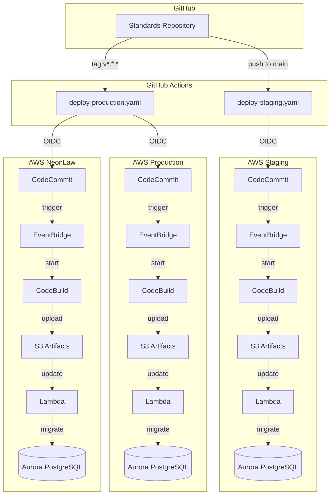
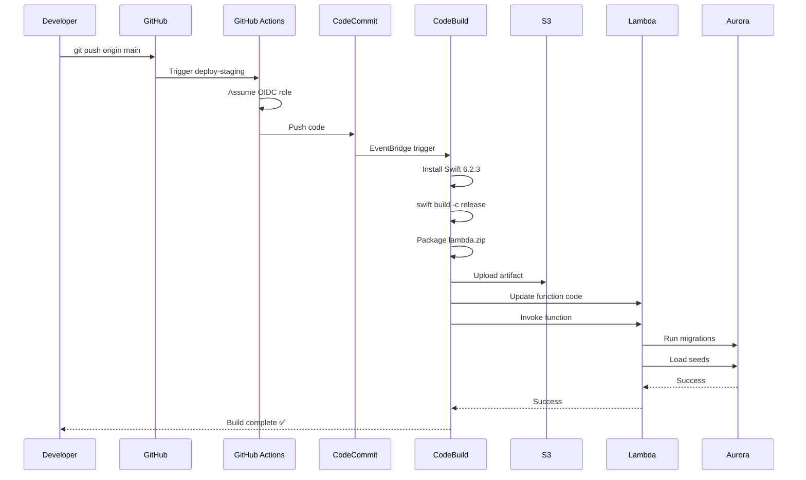

# Sagebrush Standards

Questionnaires, Workflows, and Templates together to create computable
contracts.

## Installation

### Via Homebrew (Recommended)

```bash
# Add the tap
brew tap neon-law-foundation/tap

# Install the Standards CLI
brew install standards
```

### Manual Installation

```bash
./install.sh
```

This installs the `standards` CLI to `~/.local/bin/standards`.

Make sure `~/.local/bin` is in your PATH:

```bash
export PATH="$HOME/.local/bin:$PATH"
```

## Commands

### `standards lint <directory>`

Validates Markdown files. **Does not persist to database.**

```bash
standards lint .
standards lint ShookFamily/Estate
```

**Rules:**

- **S101**: Line length ≤120 characters
- **F101**: Non-empty `title` in frontmatter
- **F102**: Valid `respondent_type`: `entity`, `person`, or `person_and_entity`

README.md and CLAUDE.md files are excluded.

### `standards import <directory>`

Validates and imports markdown files to in-memory SQLite database. Auto-detects git
repository and commit SHA.

```bash
standards import .
standards import ./notations
```

**Requirements:**

- Git repository with remote origin
- Clean working tree (no uncommitted changes)
- Files pass F101, F102 validation

**Auto-Detection:**

- Repository ID: Hashed from `git remote get-url origin`
- Commit SHA: `git rev-parse HEAD`

**Example:**

```text
📦 Git Repository ID: 1234567890
📝 Git Commit SHA: a1b2c3d4...
✅ All files valid. Starting import...
✅ Imported: contractor-agreement.md
✅ Imported: nda.md
📊 Successfully imported: 2 notation(s)
```

**Errors:**

- Not a git repository
- Uncommitted changes detected
- No remote origin configured
- Validation failures

### `standards pdf <file>`

Validates and converts Markdown file to PDF. Strips frontmatter.

```bash
standards pdf nevada.md  # Creates nevada.pdf
```

**Requirements:**

- Valid frontmatter with `title` field
- Lines ≤120 characters
- `pandoc` installed: `brew install pandoc`

## Architecture

The Standards project is organized into three main Swift Package Manager targets:

### StandardsRules

Lightweight validation rules library with zero external dependencies.

- **Location**: `Sources/StandardsRules/`
- **Purpose**: Shared validation logic for markdown files
- **Dependencies**: None (Foundation only)
- **Key Components**:
  - `Rule` protocol - Defines validation rules
  - `FixableRule` protocol - Rules that can auto-fix violations
  - `Violation` types - Structured error reporting
  - `FrontmatterParser` - YAML frontmatter parsing utility
  - Rule implementations (F101, F102, S101)

### StandardsDAL

Data Access Layer using Fluent ORM for database operations.

- **Location**: `Sources/StandardsDAL/`
- **Purpose**: Database models, migrations, and services
- **Dependencies**: Fluent, FluentPostgresDriver, FluentSQLiteDriver, Vapor, StandardsRules
- **Key Components**:
  - Fluent models (Notation, Entity, Person, etc.)
  - Database migrations
  - Service layer (NotationService, NotationValidator)
  - Repositories for data access
  - Validation at model layer using StandardsRules

**Validation Strategy:**

The DAL validates data using Swift code (not database constraints) following
Fluent best practices:

- Database constraints: Only for referential integrity (foreign keys, uniqueness)
- Swift validations: For business rules (format, content, relationships)
- Better error messages and type safety
- Cross-database compatibility (SQLite, PostgreSQL)

### StandardsCLI

Command-line interface for linting and importing notations.

- **Location**: `Sources/StandardsCLI/`
- **Purpose**: Interactive CLI tools
- **Dependencies**: StandardsRules, StandardsDAL, Logging
- **Key Components**:
  - `LintCommand` - File validation
  - `ImportCommand` - Database import
  - `PDFCommand` - PDF generation
  - `DatabaseManager` - In-memory SQLite management
  - `NotationImporter` - Markdown to database importer

**Dependency Flow:**

```text
StandardsCLI
    ├── StandardsRules (validation)
    └── StandardsDAL (persistence)
            └── StandardsRules (validation)
```

This architecture enables:

1. **Code Reuse**: Same validation rules in CLI and DAL
2. **Single Source of Truth**: Rules defined once, used everywhere
3. **Testability**: Each layer tested independently
4. **Type Safety**: Swift compiler enforces correct usage

## Initial Setup

Before using the `standards` CLI commands, you need to set up your `~/Standards`
directory structure. This is typically done using a setup script in `~/.standards/`:

### `~/.standards/` Directory

The `~/.standards/` directory contains:

- **`setup.sh`** - Shell script to initialize `~/Standards` and clone project repositories
- **`CLAUDE.md`** - Style guide template for legal contract writing
- **`.claude/`** - Claude Code configuration (agents, commands, etc.)

### Running Setup

```bash
# Initialize ~/Standards directory and clone all project repositories
~/.standards/setup.sh
```

This setup script will:

1. Create the `~/Standards` directory if it doesn't exist
2. Clone or update git repositories from configured sources
3. Copy the CLAUDE.md style guide to `~/Standards/CLAUDE.md`

**Note:** The setup script should be customized with your specific repository
URLs and access credentials. Contact your administrator for the appropriate
configuration.

## Development

Build the project:

```bash
swift build
```

## Migration Lambda Deployment

### Deployment Architecture



### Deployment Workflows



### Quick Deploy

**Staging (auto-deploy):**

```bash
git push origin main
```

**Production (manual tag):**

```bash
git tag v1.0.0
git push origin v1.0.0
```

### Monitoring

| Environment | GitHub Actions | CodeBuild | Lambda |
| ----------- | -------------- | --------- | ------ |
| **Staging** | [Workflow](https://github.com/neon-law-foundation/Standards/actions/workflows/deploy-staging.yaml) | [Project](https://us-west-2.console.aws.amazon.com/codesuite/codebuild/889786867297/projects/StandardsMigrationBuilder) | [Function](https://us-west-2.console.aws.amazon.com/lambda/home?region=us-west-2#/functions/MigrationRunner) |
| **Production** | [Workflow](https://github.com/neon-law-foundation/Standards/actions/workflows/deploy-production.yaml) | [Project](https://us-west-2.console.aws.amazon.com/codesuite/codebuild/978489150794/projects/StandardsMigrationBuilder) | Switch to account 978489150794 |
| **NeonLaw** | Same as Production | [Project](https://us-west-2.console.aws.amazon.com/codesuite/codebuild/102186460229/projects/StandardsMigrationBuilder) | Switch to account 102186460229 |

### Troubleshooting

**GitHub Actions fails (AccessDenied):**

```bash
# Check OIDC role exists
aws iam get-role --role-name GitHubActionsRole --profile sagebrush-staging
```

**CodeBuild doesn't start:**

```bash
# Check EventBridge rule
aws events list-rules --name-prefix CodeCommit --profile sagebrush-staging
```

**Swift version mismatch:**

- Update `buildspec.yml` SWIFT_VERSION to match `Package.swift` swift-tools-version
- Current: Swift 6.2.3

**Lambda can't connect to database:**

```bash
# Check Lambda logs
aws logs tail /aws/lambda/MigrationRunner --follow --profile sagebrush-staging
```

**Migrations fail:**

```sql
-- Check which migrations ran
SELECT * FROM fluent_migrations ORDER BY batch DESC;
```

### Rollback

**Lambda:**

```bash
# List versions
aws lambda list-versions-by-function --function-name MigrationRunner \
  --profile sagebrush-staging

# Use previous version from S3
aws lambda update-function-code --function-name MigrationRunner \
  --s3-bucket standards-lambda-artifacts-889786867297 \
  --s3-key lambda-TIMESTAMP.zip \
  --profile sagebrush-staging
```

**Database:**

```bash
# Restore from automatic snapshot (created before each migration)
aws rds describe-db-cluster-snapshots \
  --db-cluster-identifier staging-aurora-postgres \
  --profile sagebrush-staging
```

### Local Testing

```bash
# Start PostgreSQL
docker-compose up -d postgres

# Run migrations locally
swift run MigrationRunner

# Query results
psql -h localhost -U postgres -d app -c "SELECT * FROM fluent_migrations;"
```

---

For complete troubleshooting guide, see `DEPLOYMENT_GUIDE.md`.
