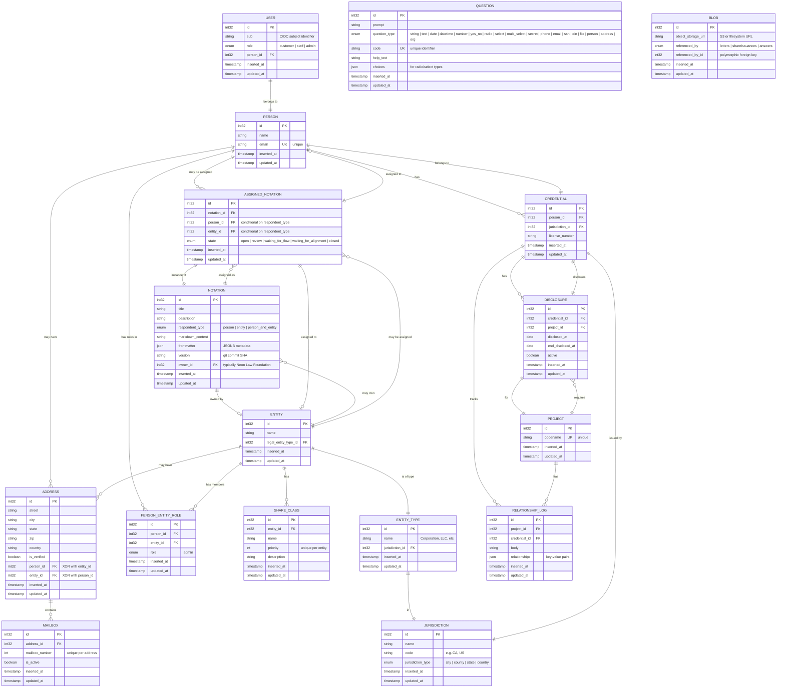

# StandardsDAL Entity Relationship Diagram

This document provides a comprehensive view of the database schema for the SagebrushStandards Data Access Layer.

## Database Schema Overview

The StandardsDAL implements a relational database schema for managing legal entities, people, credentials, notations, and their relationships. The schema supports complex workflows including notation assignment tracking with state machines, professional credential management, and entity governance.

## Entity Relationship Diagram



## Key Design Patterns

### 1. XOR Constraint (Address)

The `ADDRESS` entity uses an XOR constraint pattern where an address belongs to either a `PERSON` **OR** an `ENTITY`, but never both.

```sql
-- Database constraint ensures exactly one is set
CHECK (
    (person_id IS NOT NULL AND entity_id IS NULL) OR
    (person_id IS NULL AND entity_id IS NOT NULL)
)
```

### 2. Polymorphic Pattern (Blob)

The `BLOB` entity uses a polymorphic reference pattern with a discriminator column:

- `referenced_by` (enum): Indicates which entity type (letters | shareIssuances | answers)
- `referenced_by_id` (int32): The ID of the referenced entity

This allows flexible attachment of blobs to different entity types without multiple foreign keys.

### 3. State Machine (AssignedNotation)

The `ASSIGNED_NOTATION` entity implements a state machine with defined transitions:

```
open → review → closed
  ↓       ↓
  ↓   waiting_for_alignment → review/closed
  ↓
waiting_for_flow → open/closed
```

See `ASSIGNED_NOTATION_STATE_MACHINE.md` for detailed state transition documentation.

### 4. Conditional Relationships (AssignedNotation)

The `ASSIGNED_NOTATION` entity's foreign keys are conditionally required based on the notation's `respondent_type`:

- `person`: person_id required, entity_id must be NULL
- `entity`: entity_id required, person_id must be NULL
- `person_and_entity`: Both person_id and entity_id required

### 5. Unique Compound Index (ShareClass)

The `SHARE_CLASS` entity enforces uniqueness on the combination of `entity_id` + `priority`:

```sql
CREATE UNIQUE INDEX share_classes_entity_priority
ON share_classes (entity_id, priority)
```

This ensures each entity has a unique priority ordering for its share classes.

### 6. Git Version Tracking (Notation)

The `NOTATION` entity includes a `version` field storing the git commit SHA from the source repository. This enables:

- Audit trails for template changes
- Rollback to previous versions
- Compliance with document versioning requirements

### 7. Duplicate Prevention (AssignedNotation)

A partial unique index prevents duplicate active assignments:

```sql
CREATE UNIQUE INDEX assigned_notations_unique_open_assignment
ON assigned_notations (
    notation_id,
    COALESCE(person_id, 0),
    COALESCE(entity_id, 0)
)
WHERE state = 'open'
```

This ensures only one active assignment exists for each notation-respondent combination.

## Enum Types

### UserRole
- `customer` - Standard user role
- `staff` - Staff member role
- `admin` - Administrator role

### JurisdictionType
- `city` - City-level jurisdiction
- `county` - County-level jurisdiction
- `state` - State/Province jurisdiction
- `country` - Country-level jurisdiction

### PersonEntityRoleType
- `admin` - Administrative role in entity

### QuestionType
- `string` - Single line text
- `text` - Multi-line text (ContentEditable)
- `date` - Date picker
- `datetime` - Date and time picker
- `number` - Numeric input
- `yes_no` - Boolean yes/no
- `radio` - Radio button (XOR selection)
- `select` - Dropdown (single selection)
- `multi_select` - Multi-select dropdown
- `secret` - Sensitive data (SSN, EIN)
- `phone` - Phone number with OTP verification
- `email` - Email with OTP verification
- `ssn` - Social Security Number
- `ein` - Employer Identification Number
- `file` - File upload
- `person` - Person record reference
- `address` - Address record reference
- `org` - Entity record reference

### RespondentType (Notation)
- `person` - Notation for individual
- `entity` - Notation for organization
- `person_and_entity` - Notation for both

### AssignedNotationState
- `open` - Initial assignment state
- `review` - Response submitted, awaiting review
- `waiting_for_flow` - Blocked on dependent flow
- `waiting_for_alignment` - Waiting for entity/person alignment
- `closed` - Completed and finalized

### BlobReferencedBy
- `letters` - Referenced by letters table
- `shareIssuances` - Referenced by share_issuances table
- `answers` - Referenced by answers table

## Entity Counts (from Seeds)

Based on the seed data:
- **Jurisdictions**: 59 (all US states + DC + territories + country-level)
- **Entity Types**: 5 (Corporation, LLC, Partnership, Sole Proprietorship, Non-Profit)
- **Entities**: 1 (Neon Law Foundation)
- **Questions**: 1 (favorite color example)
- **People**: 4 (test persons)
- **Users**: 1 (linked to person)
- **Credentials**: 2 (professional licenses)
- **Addresses**: 2 (linked to entities/persons)
- **Mailboxes**: 1 (at an address)
- **PersonEntityRoles**: 9 (admin roles)

## Database Features

### Timestamps

All entities include:
- `inserted_at` - Automatically set on creation
- `updated_at` - Automatically updated on modification

### JSONB Fields

The following entities use JSONB for flexible structured data:
- `NOTATION.frontmatter` - Markdown frontmatter metadata
- `QUESTION.choices` - Radio/select option choices
- `RELATIONSHIP_LOG.relationships` - Key-value relationship data

### Unique Constraints

- `PERSON.email` - Unique email addresses
- `PROJECT.codename` - Unique project identifiers
- `QUESTION.code` - Unique question codes
- `MAILBOX` - Unique (address_id, mailbox_number)
- `SHARE_CLASS` - Unique (entity_id, priority)
- `ASSIGNED_NOTATION` - Unique open assignments per notation-respondent

## Cross-References

For detailed information on specific entities:
- State machine transitions: See `ASSIGNED_NOTATION_STATE_MACHINE.md`
- Migration history: See `Sources/StandardsDAL/Migrations/`
- Seed data: See `Sources/StandardsDAL/Seeds/`
- Model implementations: See `Sources/StandardsDAL/Models/`

## Schema Version

This ERD represents the database schema as of the latest migration:
- Migration: `202512230002_AddVersionToNotations`
- Total Migrations: 20
- Last Updated: 2025-12-23
